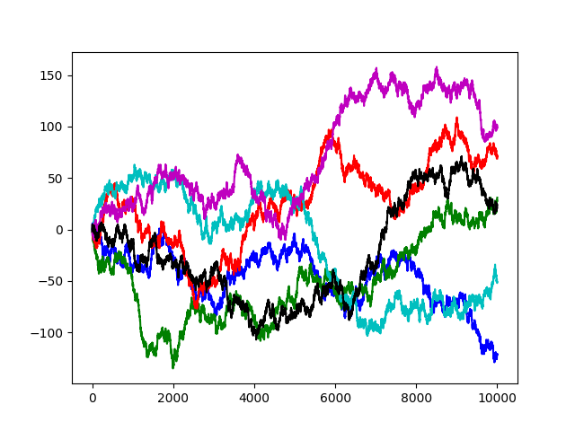

#### Quickstart Python

This is a new attempt to write a quick introduction to Python (Python 3).  Current content includes a basic intro chapter.

- [intro](chapters/intro.md)

There are several math-related chapters.

- [factors](chapters/factors.md)
- [primes](chapters/primes.md)

From this point on the code segments get a bit longer.  I admit I find it very hard to read other people's code.  

An alternative approach is to understand the problem and then try to write your own code to solve it.  My solution can serve as a guide if you run into difficulty.

One example shows how to compute the square root of 2, by successive approximation.  Actually, this approach can be adapted to any function that returns an irrational number.

Next is a much better way to calculate the square root of 2.

Finally, we calculate the logarithm of a number to a given base.  In the example, the base is 2, but it could be a anything.

- [successive approximation](chapters/sqrt.md)
- [square root of 2](sqrt2.md)
- [logarithm](chapters/log.md)

These are more chapters on sorting, on Wordle, a popular word game on the web, and on exercising the Genetic Code.

- [sorting](chapters/sorting.md)
- [wordle](chapters/wordle.md)
- [genetic code](chapters/gc.md)

I also have a discussion of Caesar ciphers, the math for public key crypto (original version based on Euler's totient function), and a demonstration of proof-of-work as it's used in Bitcoin.

- [ciphers](chapters/caesar.md)
- [public key math](chapters/math.md)
- [proof-of-work](chapters/proof.md)

Finally, there is code using the plotting library Matplotlib to demonstrate trials of a 1D random walk. 

- [walk](code/walk.py)

The output:

