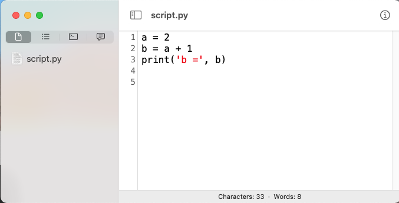

#### Getting started with Python

Python is available on a stock version of macOS --- you do not need to install it.  Open Terminal.

In the window, you will see the Terminal prompt.  Example:

```
Last login: Tue Dec 28 06:36:50 on ttys000
te@Xanadu ~ %
```

`te` is the user, `Xanadu ` is the host, and `~` is the current directory (the user `te`'s home directory).

Type `cd Desktop` and hit return.

```
te@Xanadu ~ % cd Desktop
te@Xanadu Desktop % 
```

On my account, the prompt has been modified to be `>`.  Another popular prompt is `$`.

```
> cd Desktop
>
```

This is a lot cleaner, though I admit I have to query where I am sometimes with `pwd`.

```
> pwd
/Users/te/Desktop
>
```

To get Python, simply type `python3`:

```
> python3
Python 3.8.9 (default, Aug 21 2021, 15:53:23) 
[Clang 13.0.0 (clang-1300.0.29.3)] on darwin
Type "help", "copyright", "credits" or "license" for more information.
>>>
```

Python used in this way is called the interpreter.  You can tell the interpreter is active by the prompt:  `>>>`

```
>>> a = 2
>>> a + 1
3
>>> b = a + 1
>>> b
3
>>> 2*b
6
>>> b**2
9
>>> 
>>> type(a)
<class 'int'>
```

`a` and `b` are labels for values of type `int`.

`a` and `b` are called variables.  (In older languages there is a distinction between the labels for values that could change, and those that are guaranteed to be *constant*.  Python doesn't enforce that kind of guarantee).

Arithmetic works as you'd expect except

- the symbol for multiplication is `*`
- the symbol for exponentiation is `**`
- the symbol for the modulus or remainder operation is `%`

in the line

```
>>> b = a + 1
```

the operation `+` is carried out on the value that `a` refers to (`2` above) and the integer `1` and returns a result, which I have assigned to `b`.  

#### Old Python

The current major version of Python is 3.  Python 2 is still around:

`python` or `python2` gives

```
..
Python 2.7.16 (default, Aug 30 2021, 14:43:11) 
..
```

with a deprecation warning.  At this point (2022), use Python 3.

#### scripting

A second way to use Python is to "call" the program with a **script** as the argument.

Open a plain text file and enter:

```
a = 2
b = a + 1
print('b =', b)
```

save the file as `script.txt` on your Desktop.  Open Terminal and do

```
> cd Desktop
> python3 script.txt
b = 3
>
```

When running a script in this way, you'll only see output only if you `print`, which gives the two values I supplied consecutively, adding a space between them.

It is the universal practice to name such a file with the extension `.py`, as in `script.py`

```
> mv script.txt script.py
> python3 script.py 
b = 3
>
```

#### Text editor

It is certainly possible to use the macOS application TextEdit as an editor.  Just make sure (in Preferences), that you are working with plain text.

It used to be that "plain text" referred to text with only [ASCII](https://en.wikipedia.org/wiki/ASCII) characters, but that's changed.  Anything encoded as UTF-8 will work for Python3.

Some older Unix tools are still restricted to ASCII.

Just avoid Microsoft Word or the macOS Pages app, or even "rich text".

As far as the editor to use, personally, I find it's worth five bucks every other year for Smultron.

```
https://www.peterborgapps.com/smultron/
```



It's not obvious here, but the "syntax coloring" is very helpful in orienting my eyes to the code.

Other popular apps include BBEdit and TextMate.  For editing markdown text (the source for these chapters) I use MacDown, which is free.

#### Data types

Let's return to the interpreter.  Here are some basic types of data (called data types):

- integer, abbreviated `int`
- scientific notation, or `float` (for floating point)
- text, or `str` (pronounced "string")

```
>>> a = 1
>>> type(a)
<class 'int'>
>>> type(1)
<class 'int'>
>>>
```

```
>>> pi = 3.14
>>> r = 1.5
>>> A = pi * r**2
>>> A
7.065
>>> type(pi)
<class 'float'>
```

```
>>> s = 'abc'
>>> type('abc')
<class 'str'>
>>>
```

It is also valid to use double quotes for a string, as in "abc".

```
>>> s = 'abc'
>>> t = "abc"
>>> s == t
True
>>>
```

We assigned the string `'abc'` to the variable `s`.  Then, `t` got assigned the same value.  The assignment operator is `=`.

A different operator, `==`, tests for equality.  We see that `s` is *equal* to `t`.  

#### Indexing

A sequence such as a string (or a list, see below) has the notion of position or index for each of its component values.

```
>>> s = 'abc'
>>> s[0]
'a'
>>> s[2]
'c'
>>> s[:3]
'abc'
>>> s[-1]
'c'
>>>
```

Indexing always starts from 0.  There's a good reason for that, but let's just take it as given, for now.  One can also count backward from the end.  The index of the last value is `-1`.

It is an error to call for an index that isn't valid:

```
>>> s = 'abc'
>>> s[4]
Traceback (most recent call last):
  File "<stdin>", line 1, in <module>
IndexError: string index out of range
>>>
```

One can also obtain a sublist from a given list with

`s[i:j]`

- `i` is the index of the first element
- `j` is the index of the last element, *plus one*

In other languages, this might be called a "slice".

Suppose that `n` is the number of values (characters) in the whole string.  Then `s[0:n]` will include all of them. We can obtain this number with `len(s)`.

One may omit either or both of `i` and `j`.  If `n` is the number of values in the list, `s[0:n]`, `s[:n]`, and `s[0:]` each contain all of the values.

It is *not* an error for the last index to be larger than necessary.

```
>>> s = 'abc'
>>> s[:1000]
'abc'
>>>
```

or for the first index to be smaller.

In fact, there are some weird things that are OK for slices indices like:

```
>>> s = 'abc'
>>> s[3:3]
[]
>>> s[3:]
[]
>>> s[-1:-1]
[]
>>> s[-10:-20]
''
>>>
```

#### List

A list is a collection of values, (often called an array in other languages).

```
>>> L = [2,3,4]
>>> type(L)
<class 'list'>
>>> for n in L:
...     print(n, n**2)
... 
2 4
3 9
4 16
>>>
```

Again, `n**2` means to square `n`.

One reason to call it a list rather than an array is that it is legal for Python lists to contain values of different types.

```
L = [1, 'a', 3.14]
```

This is ununsual behavior for a programming language.

#### Loop

Code within a loop is called repeatedly for some specified number of times or until some other condition is met.  This code contains a loop:

```
for x in L:
```

One can also use a `for` loop with a string:

```
>>> s = 'abc'
>>> for c in s:
...     print(c)
... 
a
b
c
>>>
```

You can think of the string as (silently) being converted to a list.

Let's use a script for this example:

**script.py:**

```
s = 'abc'
for c in s:
    print(c)
```

In Terminal:

```
> python3 script.py 
a
b
c
>
```

#### Formatting

In most languages the code that we write has some formatting required, such as ending each line (each statement) with a semi-colon ";", or using brackets { ... }

Python uses whitespace.  In the example

```
for c in s:
    print(c)
```

after the colon, the next line must be indented.

Python doesn't require any particular choice for indentation (2 spaces, 4 spaces, tab).

But it is standard to use 4 spaces, and the indentation must be the same for a given indentation level within any single file.

Strangely, it is legal to change the number of spaces for indentation at different levels.  This example is pathological, but valid.

```
>>> s = ('abc','def')
>>> for t in s:
...     for c in t:
...       if c == 'a':
...          print(t)
... 
abc
>>> 
```

We have indentation for successive levels of 4, 2, and 3 spaces.  Don't do that.

Smultron will auto-indent.  It will also convert a tab input to be 4 spaces in the file, if you set the Preferences that way.

**script.py:**

```
L = ['ab', 'cd']
for s in L:
    print(s)
    for c in s:
        print(' -' + c)
```

Terminal:

```
> python3 script.py
ab
 -a
 -b
cd
 -c
 -d
> 
```

The addition operator `+` works with strings.  So does `*`.

```
>>> print('.'*10)
..........
>>>
```

#### join and split

**script.py:**

```
L = ['ab', 'cd', 'ef']
s = '*'.join(L)
print(s)
print(s.split('*'))
```

```
> python3 script.py
ab*cd*ef
['ab', 'cd', 'ef']
>
```

`split` and `join` are `methods` of strings.

Methods are referenced using dot notation.  We'll explain this later.

#### range

`range(start,stop)` generates all the values from `start` up to but not including `stop`.  In math, this is known as a half-open interval.

If only one number is given, it will be interpreted as `stop`.  Then, the default for `start` is `0`.

One can specify a step size with `range(start,stop,step)`.  The default step size is `1`.  Technically a range is not a list, but it acts like one.

```
>>> R = range(5)
>>> list(R)
[0, 1, 2, 3, 4]
>>> for i in range(5):
...     print(i)
... 
0
1
2
3
4
>>>
```

A traditional way to keep track of the iterations of a loop is to use a counter.

```
>>> counter = 0
>>> while counter < 3:
...     counter = counter + 1
...     print('go')
... 
go
go
go
>>>
```

And

```
counter = counter + 1
```

is done more idiomatically as `counter += 1`.  

These are all valid operators:  `+=`, `-=`, `*=` and `/=`.  


#### enumerate

`enumerate` walks us through a list returning both the index and the value at that index.

```
>>> for i,c in enumerate('abc'):
...     print(i,c)
... 
0 a
1 b
2 c
>>>
```

This could be done in other ways, for example

```
>>> s = 'abc'
>>> for i in range(len(s)):
...     c = s[i]
...     print(i,c)
... 
0 a
1 b
2 c
>>>
```

#### Reading a file

Suppose `x.txt` is also on the Desktop, and it contains the following text:

```
This is some text.
```

We can load the data from the file with the following code:

**script.py:**

```
fn = 'x.txt'
FH = open(fn)
data = FH.read()
FH.close()

print(len(data))
print(data)
```

```
> python3 script.py
18
This is some text.
>
```

The names of variables are up to you.  I always use `fn`, short for filename.  Also FH, for `file handle`.

There is a newer (preferred) method.  Some day I'll get used to it.

**script.py:**

```
with open(fn) as fh:
    data = fh.read()
print(data)
```

```
> python3 script.py
This is some text.
```

#### More about lists

```
>>> data = '2 3 5 7 11 13'
>>> list(data)
['2', ' ', '3', ' ', '5', ' ', '7', ' ', '1', '1', ' ', '1', '3']
```

We almost always want ints, not strings.

```
>>> L = data.split()
>>> L
['2', '3', '5', '7', '11', '13']
>>> [int(s) for s in L]
[2, 3, 5, 7, 11, 13]
>>>
```

The `split` method takes an optional argument, namely the character on which to split.

You might think about how to do this one character at a time.

```
>>> data = '2 3 5 7 11 13'
>>> buffer = ''
>>> for c in data:
...     if c != ' ':
...         buffer += c
...     else:
...         L.append(int(buffer))
...         buffer = ''
>>> L.append(int(buffer)) 
>>> 
>>> L = L[1:]
>>> L
[3, 5, 7, 11, 13]
>>>
```

As we said, `=` is the assignment operator, as in `a = 1`, whereas `==` is a test for equality, as in `a == b`.  This evaluates to True if `a` is equal to `b`.  

`!=` ia  test for *not equal*.

``if <some test> .. else`` is a branching structure, we'll explain more below.

#### newlines

```
>>> data = '>seq1\nATCG\nATGC'
>>> print(data)
>seq1
ATCG
ATGC
>>> title, rest = data.split('\n',1)
>>> title
'>seq1'
>>>
>>> rest
'>ATCG\nATGC'
>>> dna = ''.join(rest.split())
>>> dna
'ATCGATGC'
>>>
```

`\n` indicates a newline.  It is a "control character".  In the ASCII table, its value is decimal 10, in hex `0a`.


#### Saving to a file

```
>>> data = '>seq1\nATCG\nATGC'
>>> fn = 'out.txt'
>>> FH = open(fn,'w')
>>> FH.write(data)
15
>>> FH.close()
>>> 
```

A file can be opened for either reading or writing but not both at the same time.  The `w` indicates we want to write.  `15` is the amount of data written to disk (in bytes).

We can also examine the data in a file with the Unix utility `hexdump`.

```
> hexdump -C out.txt
00000000  3e 73 65 71 31 0a 41 54  43 47 0a 41 54 47 43     |>seq1.ATCG.ATGC|
0000000f
>
```

You can look up those values in a table of ASCII.  I would note that the newlines, represented inside Python by `'\n'` in a string, are written to the file as `0a`.

Newlines are different in Windows.  The difference is one source of compatibility issues between macOS and Linux, on one hand, and Windows.

When printed, `\n` says to start a new line.

The argument 1 to `split` says to do the split only for the first `\n` that is encountered.

The backslash before the `n` in `\n` indicates this is a control character, and not a normal n.

#### chr and ord

```
>>> s = 'abc'
>>> for c in 'hello':
...     print(c, ord(c))
... 
h 104
e 101
l 108
l 108
o 111
>>> chr(10)
'\n'
>>>
```

#### Dictionary

A second major type of "collection", the dictionary, can be defined either with brackets, or by calling the function `dict()`, which returns an empty dictionary.

```
>>> D = {'a':65, 'b':66}
>>> D['a']
65
>>> D = dict()
>>> D['ATG'] = 'methionine'
>>> D['ATG']
methionine
>>>
```

It is very common to construct a dictionary from two lists that have been paired together (with `zip`).

```
>>> L = 'abcde'
>>> oL = [ord(c) for c in L]
>>> D = dict(zip(L,oL))
>>> D
{'a': 97, 'b': 98, 'c': 99, 'd': 100, 'e': 101}
>>>
```

We'll see a lot more about dictionaries.

#### Modules

Modules are separate files (or groups of files) that contain additional code.  The names defined in a module and/or its components are only available after they are "imported".  

One standard module is the `math` module:

```
>>> from math import pi
>>> pi
3.141592653589793
>>> 
```

Another way which is arguably better is to use the "qualified" names like: `math.pi`:

```
>>> import math
>>> math.pi
3.141592653589793
>>> math.degrees(1)
57.29577951308232
>>> math.radians(180)
3.141592653589793
>>>>>> math.sqrt(2)
1.4142135623730951
```

This is better because if two modules use the same name for different things they will not get in each other's way.

Notice that `radians` expects its argument will be in degrees, and the opposite for `degrees`.

#### Functions

A function is just like what you'd expect.  It is a machine that takes some input and produces output.

To define a function use the keyword `def`

```
>>> def f(n):
...     return n*n
... 
>>> f(2)
4
>>> f(3)
9
>>>
```

With this definition, when the function is called, we must supply a value or a variable, one for which `n*n` makes sense.

```
>>> f()
Traceback (most recent call last):
  File "<stdin>", line 1, in <module>
TypeError: f() missing 1 required positional argument: 'n'
>>> f('a')
Traceback (most recent call last):
  File "<stdin>", line 1, in <module>
  File "<stdin>", line 2, in f
TypeError: can't multiply sequence by non-int of type 'str'
>>>
```

Errors say what *kind* of error they are.  We'll put off that discussion for now.

We've seen several functions already.

```
print
int
type
sqrt
```

`join` and `split` are slightly different.  They are functions but are thought of us belonging to the string.

```
'*'.join(L)
```

calls the string "method" join with the argument `L`.

Functions can be constructed and returned by other functions.

```
>>> def f(i):
...     def g(n):
...         return n + i
...     return g
... 
>>> h = f(2)
>>> h(1)
3
>>>
```

#### User code saved in a module

Take the code for loading data from a file that we had before and save it as

**utils.py:**

```
def load_data(fn):
    FH = open(fn)
    data = FH.read()
    FH.close()
    return data
```

**script.py:**

```
from utils import load_data
data = load_data('x.txt')
print(data)
```

```
> p3 script.py
This is some text.
>
```

#### Command line arguments

It's often useful to pass data into a script from the command line.

```
> p3 script.py 1 2 3
```

To access those values use the `sys` module

**script.py**

```
import sys
for arg in sys.argv:
    print(arg)
```

```
> p3 script.py 1 2 3
script.py
1
2
3
>
```

`sys.argv` is a list.  

The first element is the name of the script.
These values come into the script as strings.

To do math, first convert them to ints:

```
import sys 
L = sys.argv[1:]
L = [int(s) for s in L]
print(sum(L))
```

```
> p3 script.py 1 2 3
6
>
```

#### List comprehension

```
iL = [int(s) for s in L]
```

Calls the function `int` (which converts a string to an integer), on each `s` in `L`, and then saves the result in a new list.

#### Branching

**script.py**

```
L = [1,2,3,4,5,6]
for n in L:
    if n % 2 == 0:
        print(n**2)
    else:
        print('.')
```

```
> python3 script.py
.
4
.
16
.
36
>
```

`%` is the modulus or remainder operator

```
>>> [n for n in range(10) if n % 2 == 0]
[0, 2, 4, 6, 8]
>>>
```


#### while

```
>>> x = 2
>>> while x > 0:
...     print x
...     x -= 1
...
2
1
```

```
>>> L = list()
>>> s = 'AGCTAGCT'
>>> while True:
...     i = s.find('A', i+1)
...     if i == -1:
...         break
...     L.append(i)
...
>>> print L
[0, 4]
```

The `while` construct evaluates its argument to decide
whether to enter the loop.

`break` gets us out of the loop.

Another special word is `continue`.  Let's see the difference between `continue` and `break`:

```
>>> for x in range(5):
...     if x == 1:
...         continue
...     print(x)
...     if x == 2:
...         break
... 
0
2
>>>
```

We didn't print `1` because of `continue`, but after `2` we hit `break` and broke out of the loop.

If you write a loop and for some reason you never `break` out of it, your program will run forever.  Use `CTL-Z` to stop the Python interpreter.  This does what you'd expect.

**script.py**

```
n = 0
while True:
    n += 1
```
