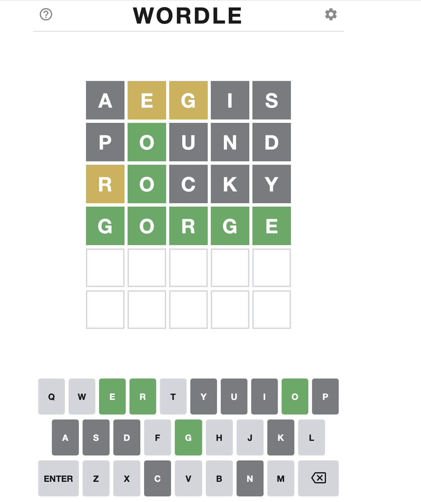
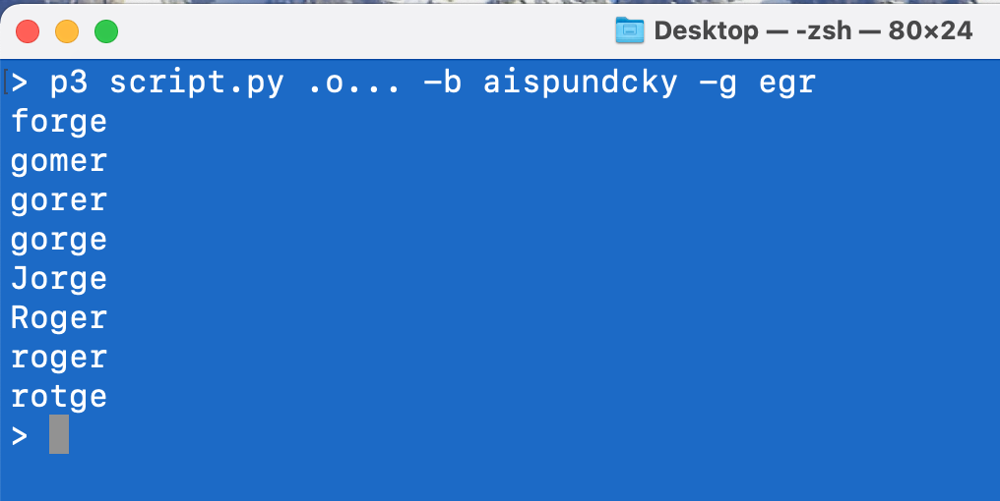

#### Wordle

In the last month or so, a new word game on the web has become very popular:  [Wordle](https://www.powerlanguage.co.uk/wordle/).

Here is a screenshot from the game for today, Jan 9, 2022.

In the first round, I tried `AEIOU` which isn't a legal guess, because it isn't a word.  So then I changed it to retain the first three vowels.

The result colors `E` and `G` as tan, meaning they occur in the target word, but are not at the correct position.



In the second round I tried different letters and scored a hit with `O`, which is the second letter of the mystery word.

After the third round I had one letter in position and knew three that were out of position.  I got lucky with my guess.

#### A wordle cracker

On Unix (and macOS) there is a dictionary of common English words in `/etc/share/dict/words`.

I decided to write a [script](../code/wordle.py) that could take information from my guesses and output possible matches from the words list.

The first idea was to input letters in the correct position as `.O...` (from the example above).

Then, the problem is to tell the script about letters that are in the word but out of order, as well as those that are not in the word.  

It is common to use the terms whitelist and blacklist for this purpose, but I think it's better to avoid that and I use `-g` and `-b` (for good, and bad) instead.

For example, given the data from the first round I might do

```
> python3 wordle.py ..... -g eg -b ais
```

For round two

```
> python3 wordle.py .o... -g eg -b aispund
```

and after that

```
> python3 wordle.py .o... -g egr -b aispundcky
```

At this point the output is



#### Command line arguments

Here is the code to input the data (allowing the flags `-b` and `-g` to be in either order or absent altogether:

```
t = sys.argv[1]
g = []
b = []

for i,arg in enumerate(sys.argv):
    if arg == '-g':
        g = list(sys.argv[i+1])
    elif arg == '-b':
        b = list(sys.argv[i+1])
```
We don't do any error handling.

#### Search

The other part is the code to search the word list.

```
def test(word,t):
    for x in word:
        if x in b:
            return
    for y in g:
        if not y in word:
            return
    for x,y in zip(word,t):
        if y == '.':
            continue
        if x != y:
            return
    return word

pL = []
for word in L:
    if len(word) == len(t):
        match = test(word,t)
        if match:
            pL.append(match)
      
N = len(pL)      
print(N)
if N < 20:
    for word in pL:
        print(word)
```

Output:

```
> python3 wordle.py ..... -g eg -b ais
192
> python3 wordle.py .o... -g eg -b aispund
21
> python3 wordle.py .o... -g egr -b aispundcky
8
forge
gomer
gorer
gorge
Jorge
Roger
roger
rotge
>
```

We employ a common idiom for search:  if there is a value to return, we do so, but otherwise return `None` (which is what a `return` statement by itself does).  Then, in the caller, we first check whether the result is `None` by doing `if match:`.